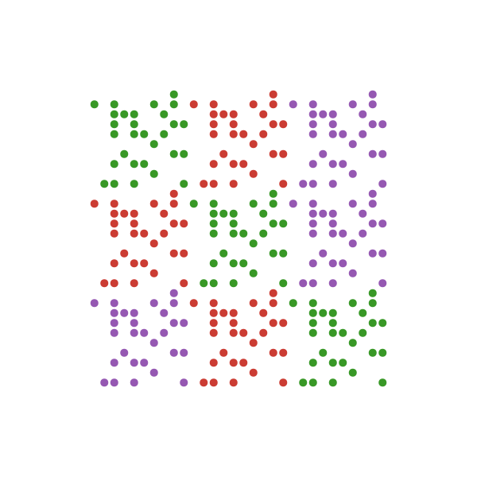
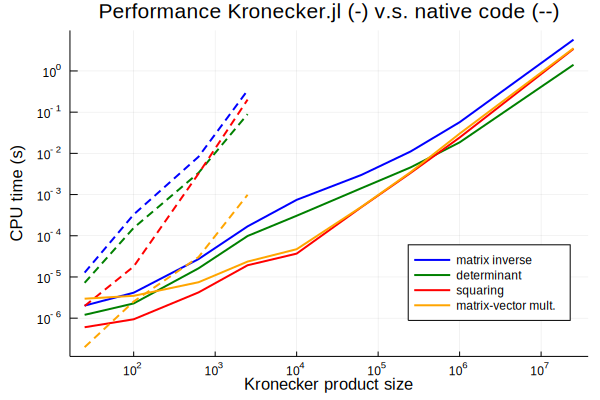

# Kronecker.jl



This is a Julia package to efficiently work with Kronecker products. It combines lazy evaluation and algebraic tricks such that it can implicitely work with huge matrices. It allows to work with large Kronecker systems both much faster and using much less memory than the naive implementation of the Kronecker product.

## Features

Given two matrices (subtype of `AbstractArray`) `A` and `B`, one can construct an instance of the `KroneckerProduct` type as `K = A ⊗ B` (typed using `\otimes TAB`). Equivalently, the function `kronecker` function can be used as well. Several functions are implemented.

- `collect(K)` computes the Kronecker product (**not** recommended!)
- `tr`, `det`, `size`, `eltype`, `inv`, ... are efficient functions to work with Kronecker products. Either the result is a numeric value or a new `KroneckerProduct` type is returned
- Multiplying with a vector `v` is efficient using the [vec trick](https://en.wikipedia.org/wiki/Kronecker_product#Matrix_equations): `K * v`
- Solving systems of the form `A ⊗ B + cI`
- Working with incomplete systems using the [sampled vec trick](https://arxiv.org/pdf/1601.01507.pdf)
- Basic compatibility with higher-order Kronecker systems, e.g. `A ⊗ B ⊗ C` or `kronecker(A, 4)` which is equivalent with `A ⊗ A ⊗ A ⊗ A`
- A `KroneckerSum` can be constructed with `A ⊕ B` (typed using `\oplus TAB`) or `kroneckersum(A,B)`
  - Multiplication with vectors uses  a specialized version of the vec trick
  - Higher-order sums are supported, e.g. `A ⊕ B ⊕ C` or `kroneckersum(A,4)`
- [in progress] GPU compatibility!
- [in progress] Autodiff for machine learning models!

Read the [documentation](https://michielstock.github.io/Kronecker.jl/latest/) to get the specifics.

## Benchmarks

Below is a [comparision](scrips/benchmarks.jl) between the native `kron` function and `Kronecker.jl` for several operations.



## Example

```julia
using Kronecker

A = randn(100, 100);
B = rand(50, 50);

v = rand(5000);

K = A ⊗ B

collect(K)  # equivalent with kron(A, B)

K[78, 43]

tr(K)
inv(K)  # yields another lazy Kronecker instance

K * v  # equivalent with vec(B * reshape(v, 50, 100) * A')
```

See the notebook for some more advanced use.

## Installation

Directly available via the Julia package manager:

```julialang
] add Kronecker
```

## Issues

This is very much a work in progress! Please start an issue for bugs or requests to improve functionality. Any feedback is appreciated!

## Status `master` branch

[](https://michielstock.github.io/Kronecker.jl/latest/)[](https://travis-ci.com/MichielStock/Kronecker.jl) [](https://coveralls.io/github/MichielStock/Kronecker.jl?branch=master) [](https://zenodo.org/badge/latestdoi/160198570)

